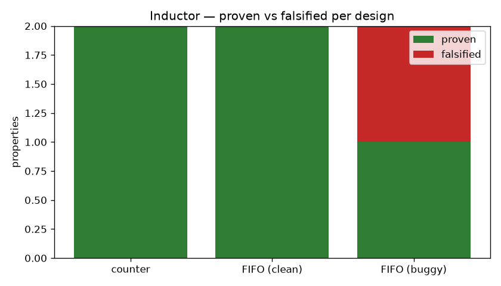

# Inductor

> **AI that writes and proves correctness properties for chips.**

Inductor reads a spec and a small RTL module, synthesizes formal properties with an
LLM, runs an open-source model checker (Yosys + SymbiYosys), and iterates on
counterexamples — automating the hardware-verification engineer's inner loop. The
LLM proposes; the solver disposes, so **hallucination cannot pass verification**.
Every reported result is a bounded proof to depth *k*, an unbounded proof, or a
concrete counterexample waveform — never the model's unverified say-so.

The demo: point it at a FIFO with an injected off-by-one in its `full` flag. Inductor
checks the flag/occupancy invariant `full ⟺ count==DEPTH`, **proves it on the correct
FIFO and falsifies it on the buggy one** with a solver counterexample — a state where
the flag disagrees with the true occupancy at the `DEPTH` boundary — and narrates the
failing cycle deterministically.

**Status:** M1–M5 built — verifies real RTL end-to-end, catches an injected FIFO bug,
and checks RTL-to-RTL equivalence, all on a real solver. The LLM synthesis path ran
live against `claude-opus-4-8` and is replayed from a recorded fixture in CI. See
[ROADMAP.md](ROADMAP.md) for the plan.

---

## See it work

**1 — The AI writes the properties; the solver proves them** (recorded live,
`claude-opus-4-8`). Claude reads the spec + the Yosys-extracted interface and
synthesizes properties; they pass a Yosys compile gate, then the model checker
discharges each one. This run produced **9 properties — 5 safety asserts + 4
reachability covers** — which compiled on the first attempt; every assert proves:

```
# recorded synthesis: 9 properties (5 asserts + 4 covers), compiled in 1 attempt
| Property                                       | Verdict   | Engine              |
|------------------------------------------------|-----------|---------------------|
| P1  After synchronous reset, count is 0        | ✅ PROVEN | yosys-sat (minisat) |
| P2  Enabled below max increments by 1          | ✅ PROVEN | yosys-sat (minisat) |
| P3  Enabled at max saturates at 15 (no wrap)   | ✅ PROVEN | yosys-sat (minisat) |
| P4  Disabled out of reset holds value          | ✅ PROVEN | yosys-sat (minisat) |
| P5  count never exceeds 15                      | ✅ PROVEN | yosys-sat (minisat) |
```

Recorded to [`tests/fixtures/counter.synth.json`](tests/fixtures/counter.synth.json)
and replayed offline with **no API key** — `pytest -m integration -k recorded_synthesis`
reproduces the table above (the 4 covers are anti-vacuity witnesses; yosys-sat reports
`unknown` for cover mode, so only the 5 asserts carry a verdict). A fresh live run
(needs `ANTHROPIC_API_KEY`, and is non-deterministic run to run):
`inductor verify designs/counter.v --spec designs/counter.md --top counter`.

**2 — It catches a real bug, with a solver counterexample.** The buggy FIFO computes its
`full` flag one slot early — `assign full = (cnt == 3'd3)` instead of `== 4`. The
structural invariant `full ⟺ count==DEPTH(4)` **proves on the correct FIFO and is
falsified on the buggy one**; the solver returns a state where `count == 4` yet
`full == 0`, exactly the dropped boundary:

```
$ inductor verify designs/fifo_buggy.v --top fifo --no-llm --props designs/fifo.props.json
| F1  full is asserted exactly when count == DEPTH (4) | ❌ FALSIFIED | yosys-sat | depth 20 |
| F2  empty is asserted exactly when count == 0        | ✅ PROVEN    | yosys-sat |    —     |

step |  rst  wr_en  rd_en  full  empty  count
   0 |   1     0      1      0     0      4    ← count==4 but full==0: the off-by-one boundary
   1 |   1     0      0      0     1      0
   ⋮   (steps 2–18 identical: rst=1, count=0, full=0, empty=1)
  19 |   0     0      0      0     1      0    ← counterexample ends
```

On the yosys-sat backend the counterexample lands at the unconstrained initial state,
because this backend can't apply the reset assumption (ADR-0004); the reset-driven
temporal overflow story is the sby-backend path (roadmap H2).

**3 — It proves (or disproves) RTL-to-RTL equivalence.** A miter with shared symbolic
inputs — the hardware sibling of *Congruent*:

```
$ inductor equiv designs/max2.v designs/max2_alt.v     --top-a max2 --top-b max2_alt      → ✅ PROVEN
$ inductor equiv designs/max2.v designs/max2_min_bug.v --top-a max2 --top-b max2_min_bug  → ❌ FALSIFIED
    distinguishing input at step 0:  a=4  b=2  →  max2 y=4   impostor y=2
```

Every verdict is tied to a real solver run — never the model's say-so. A pass with an
unreachable witness is reported `VACUOUS`, and `PROVEN` is only awarded by an unbounded
engine (k-induction / PDR); BMC alone is an honest `BOUNDED-PASS`.



The solver runs (2, 3, and the bug-catch chart) need nothing but `pip install` (Yosys
via `yowasp-yosys`) and run on Windows; the live-LLM synthesis in (1) needs an
`ANTHROPIC_API_KEY`, and its output is recorded as a fixture so CI replays the AI path
with no key.

---

## Run it

**Prerequisites:** **Python ≥ 3.11** (check: `python --version`). For the actual
verification you need a model checker — pick one:

- **Lightweight (works on Windows, no admin):** `pip install yowasp-yosys` — Yosys as
  WebAssembly. Drives the built-in `sat` backend (internal minisat, no external
  solver). This is what the dev install (`.[dev]`) pulls in.
- **Full stack:** the **OSS CAD Suite** (Yosys + SymbiYosys + Bitwuzla) on PATH —
  https://github.com/YosysHQ/oss-cad-suite-build — for the `sby` backend. Linux-native;
  **on Windows use WSL2**.

The offline `demo` and the unit tests need neither.

```bash
python -m venv .venv && source .venv/Scripts/activate   # Windows Git Bash
                                                        # (Linux/macOS: .venv/bin/activate)
pip install -e ".[dev]"     # once (includes yowasp-yosys)

inductor demo               # offline showcase: render a wrapper + a sample report
# Verify real RTL (run from the repo root; yowasp-yosys is sandboxed to the CWD):
inductor verify designs/counter.v --spec designs/counter.md --top counter --no-llm
# → P1, P2 ✅ PROVEN.  Try the over-strong property to see a counterexample:
inductor verify designs/counter.v --top counter --no-llm --props designs/counter_bad.props.json
# → PB ❌ FALSIFIED, with a waveform written under designs/_build/.

pytest                      # unit tests (fast, offline)
pytest -m integration       # runs a real proof via Yosys (needs a Yosys on PATH)
```

### The demo that lands

```bash
# Clean FIFO: the flag/occupancy invariants hold.
inductor verify designs/fifo.v --top fifo --no-llm --props designs/fifo.props.json
#   → F1 (full ⟺ count==4), F2 (empty ⟺ count==0)  ✅ PROVEN

# Buggy FIFO (off-by-one `full`): the bug is caught with a counterexample.
inductor verify designs/fifo_buggy.v --top fifo --no-llm --props designs/fifo.props.json
#   → F1 ❌ FALSIFIED (waveform shows full=0 at count==4); F2 ✅ PROVEN

# Benchmarks (charts need the `bench` extra: pip install -e ".[bench]"):
python -m benchmarks.bugcatch          # per-design verdicts + bug-catch chart
python -m benchmarks.depth_vs_time     # bounded-proof time vs BMC depth

# RTL-to-RTL equivalence:
inductor equiv designs/max2.v designs/max2_alt.v    --top-a max2 --top-b max2_alt     # ✅ PROVEN
inductor equiv designs/max2.v designs/max2_min_bug.v --top-a max2 --top-b max2_min_bug # ❌ distinguishing input
```

### Commands

| Command | What it does |
|---|---|
| `inductor demo` | Offline: render the formal wrapper + a sample verdict report. |
| `inductor verify <rtl…> --top <name> --no-llm` | Discharge a hand-written property file against the RTL. |
| `inductor verify … --backend {auto,sby,yosys-sat}` | Pick the engine (auto: sby if present, else yosys-sat). |
| `inductor equiv <a.v> <b.v> --top-a A --top-b B` | Prove two designs equivalent, or find a distinguishing input. |
| `inductor extract <rtl…> --top <name>` | Print the extracted interface model (debug). |
| `pytest` / `pytest -m integration` | Unit tests / live end-to-end tests. |
| `ruff check . && mypy` | Lint + typecheck. |

---

## Project docs

| Doc | What's in it |
|---|---|
| [DESIGN.md](DESIGN.md) | The full design and rationale — the single source of truth. |
| [ROADMAP.md](ROADMAP.md) | The milestone checklist (the plan + what's done). |
| [`docs/`](docs/) | Architecture decision records (ADRs) and long-form notes. |

## Tech stack

Python 3.11 · Yosys + SymbiYosys + Bitwuzla (open formal stack, ISC/MIT) ·
Anthropic SDK (`claude-opus-4-8`) · pytest / ruff / mypy. Pairs with **Congruent**
(software equivalence) as the formal-methods-meets-AI portfolio spine.

## License

MIT — see [LICENSE](LICENSE).
